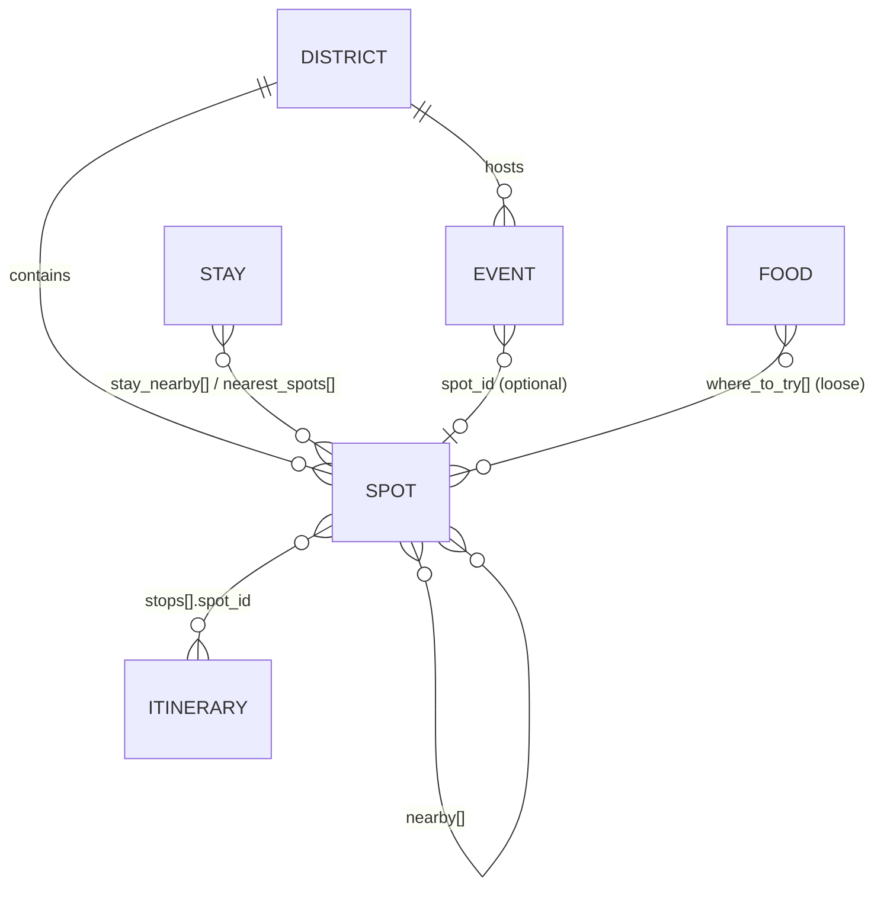

# 01 — Data Model

Status: Draft v0.1 · Last updated: 2026-08-08 · Normative

## Entities

| Entity | File location (target) | Cardinality | Spec |
|---|---|---|---|
| **Spot** | `data/spots/{district}/{slug}.json` | ≈ 64 | [02](02-spot-schema.md) |
| **District** | `data/districts/{district}.json` | 2 | [03](03-companion-schemas.md) |
| **Itinerary** | `data/itineraries/{slug}.json` | ≥ 6 | [03](03-companion-schemas.md) |
| **Event** | `data/events/{slug}.json` | ≥ 8 | [03](03-companion-schemas.md) |
| **Stay** | `data/stays/{slug}.json` | ≥ 15 | [03](03-companion-schemas.md) |
| **Food** | `data/food/{slug}.json` | ≥ 10 | [03](03-companion-schemas.md) |

Registries (not entities, no files of their own): **clusters**, **hubs**, **enums/vocabularies** — all defined in [spec 04](04-taxonomies.md).

## Relationships



All cross-references are **by `id`** (never by name). Referential integrity is enforced at validation level L2 ([spec 07](07-quality-and-verification.md)).

## Identity rules

| Rule | Definition |
|---|---|
| `slug` | kebab-case ASCII: `^[a-z0-9]+(-[a-z0-9]+)*$`. Derived from the common English/signage name (see transliteration rules in [spec 05](05-content-guidelines.md)). |
| `id` | `{district}-{slug}` where `district ∈ {dang, narmada}` — e.g. `dang-girmal-falls`. |
| Filename | `data/spots/{district}/{slug}.json`. Validator enforces `id == district + "-" + slug == folder + "-" + filename`. |
| Immutability | Published `id`s never change and are never reused. Renamed places keep their `id` and gain an alias; closed places set `status`, the file stays. |
| Circuit district | `district` is the *circuit* a spot belongs to, matching the id prefix and folder. For flagged adjacents (Hatgadh, Vansda NP, Kabirvad, Padam Dungari), `location.outside_district = true` and `location.admin_district` records the real administrative district — e.g. `"Nashik (Maharashtra)"`. |

## Clusters

A `cluster` is a geographic/experiential grouping the app can render as an "area" (e.g. everything inside the ticketed Statue of Unity campus). One cluster per spot, nullable. Cluster ids must come from the registry in [spec 04](04-taxonomies.md#clusters). Clusters never cross districts.

## Null semantics (project-wide, all entities)

| Value | Meaning |
|---|---|
| `null` | **Unknown / not yet researched.** A `null` on a volatile field usually pairs with an entry in `provenance.needs_verification`. |
| `[]` / `{}` | **Known-empty.** e.g. `fees: []` = confirmed free; `timings: []` = open area with no gates; `attributes: {}` = nothing notable. |
| Key absent | Not allowed at record/group level — records always carry the **full key template** (see below). Only leaf array-items may omit optional keys where spec 02 says so. |

**Template completeness:** every spot record contains *all* top-level and group-level keys defined in spec 02, with `null`/`[]` where data is pending. This makes research progress visible in diffs and keeps consumers free of existence checks.

## Repo layout

```
README.md
specs/00…09-*.md            ← normative documents (this suite)
schema/spot.schema.json     ← machine schema, mirrors spec 02 (companion schemas added in phase 5)
seed/spots-master.csv       ← phase 1: generated from specs/08, then hand-tuned
data/…                      ← phase 2+: records (layout per Entities table above)
scripts/…                   ← phase 1: validate / lint / stats (see spec 06)
```

## Formatting conventions (all JSON and Markdown)

- **Encoding:** UTF-8, no BOM. (PowerShell caution: use tooling/editors that write BOM-less UTF-8; `Out-File -Encoding utf8` on Windows PowerShell 5.1 writes a BOM.)
- **Line endings:** LF (enforced via `.gitattributes`).
- **JSON style:** 2-space indent, no trailing commas, final newline. Key order follows the template order in spec 02 (lint-warned, not schema-enforced).
- **Dates:** ISO `YYYY-MM-DD`. **Times:** 24-hour `HH:MM`. **Months:** integers 1–12 in data, names in prose.
- **Money:** integer INR in data (`amount_inr`), `₹` only in prose. **Distances:** km, ≤1 decimal. **Heights/altitude:** metres, integers.

## Schema versioning

`schema_version` is an integer on every record. Breaking schema changes bump it and ship with: (a) an updated spec 02 + `schema/`, (b) a migration note in `CHANGELOG.md`, (c) a one-shot migration script under `scripts/`. Additive nullable fields are non-breaking and do not bump the version.
